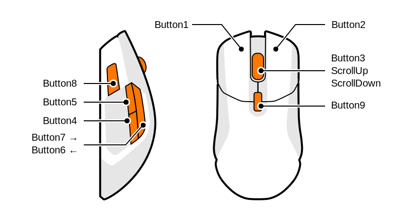

SteelSeries Rival 5
===================

Supported Models
----------------

.. rivalcfg_device_family:: rival5

Command-Line Usage
------------------

.. rivalcfg_device_cli:: rival5

Sensitivity (DPI)
-----------------

This mouse supports up to 5 sensitivity presets (short option: ``-s``).
You can define them like this:

::

	rivalcfg --sensitivity 800       # one preset
	rivalcfg --sensitivity 800,1600  # two presets

You can switch preset using the button under the mouse wheel.

.. NOTE::

   When you set the sensitivity through the CLI, the selected preset always
   back to the first one.

Polling Rate
------------

Use ``--polling-rate`` (short option: ``-p``) to set the polling rate (in Hz).
Supported values are
``125``, ``250``, ``500`` and ``1000``.

Colors
------

This mouse supports colors. Various formats are supported.

.. include:: ./_colors.rst

The ``--color`` option (short option: ``-c``) applies the same color to all
LEDs. Example::

	rivalcfg --color green

If you want to set each LED separately, use the following options:

- ``--wheel-color`` (short option: ``-cw``)
- ``--top-left-color`` (short option: ``-ctl``)
- ``--top-right-color`` (short option: ``-ctr``)
- ``--middle1-left-color`` (short option: ``-cml1``)
- ``--middle1-right-color`` (short option: ``-cmr1``)
- ``--middle2-left-color`` (short option: ``-cml2``)
- ``--middle2-right-color`` (short option: ``-cmr2``)
- ``--bottom-left-color`` (short option: ``-cbl``)
- ``--bottom-right-color`` (short option: ``-cbr``)
- ``--logo-color`` (short option: ``-cl``)

Or use the ``--strip-color`` (short option: ``-z``) with 10 colors separated by ``;``. Example::

	rivalcfg --strip-color "11ff11; 22ff22; 66ff66; 33ff33; 77ff77; 44ff44; 88ff88; 55ff55; 99ff99; aaffaa"

.. IMPORTANT::

   On newer SteelSeries mice, the color settings are not saved in the onboard
   memory anymore (see Default Lighting bellow).

Reactive Color
--------------

The reactive color changes LED colors when you click a button. You can disable
it with ``off`` or ``disable``. Example::

	rivalcfg --reactive-color off
	rivalcfg --reactive-color red

LED Brightness
--------------

Use ``--led-brightness`` (short option: ``-l``) to set the brightness in
percent. Supported values are
``100``, ``75``, ``50``, ``25`` and ``0``.

Lighting Effects
----------------

Use ``--rainbow-effect`` (short option: ``-e``) to enable the onboard rainbow
effect. You can also
set the default lighting on startup with ``--default-lighting`` (``off`` or
``rainbow``). The short option for ``--default-lighting`` is ``-d``.

Default Lighting
----------------

.. include:: ./_default_lighting_reactive.rst

Buttons
-------

Use ``--buttons`` (short option: ``-b``) to change the button mapping.

.. include:: ./_buttons.rst

Python API
----------

TODO
