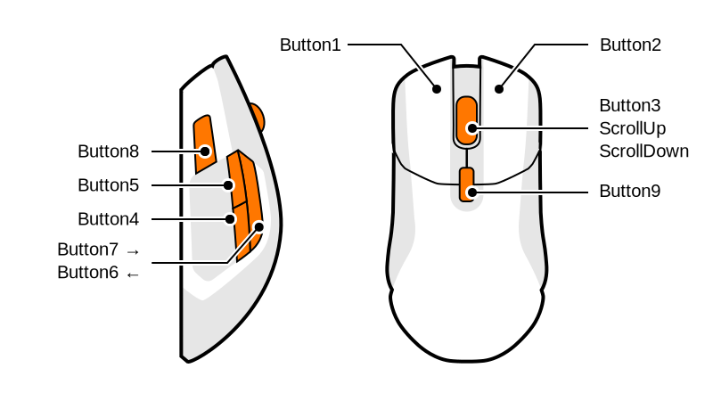

SteelSeries Rival 5
===================

Supported Models
----------------

.. rivalcfg_device_family:: rival5

Missing Features
----------------

The following feature are currently not supported by Rivalcfg:

* Selective rainbow effect (rainbow effect on some LEDs only instead of all LEDs).

Command-Line Usage
------------------

.. rivalcfg_device_cli:: rival5

Sensitivity (DPI)
-----------------

This mouse supports up to 5 sensitivity presets (short option: ``-s``).
You can define them like this:

::

    rivalcfg --sensitivity 800       # one preset
    rivalcfg --sensitivity 800,1600  # two presets

You can switch preset using the button under the mouse wheel.

.. NOTE::

   When you set the sensitivity through the CLI, the selected preset always
   back to the first one.

Polling Rate
------------

Use ``--polling-rate`` (short option: ``-p``) to set the polling rate (in Hz).
Supported values are
``125``, ``250``, ``500`` and ``1000``.

Colors
------

This mouse supports colors. Various formats are supported.

.. include:: ./_colors.rst

.. IMPORTANT::

   On newer SteelSeries mice, the color settings are not saved in the onboard
   memory anymore (see Default Lighting bellow).

Reactive Color
--------------

The reactive color changes LED colors when you click a button. You can disable
it with ``off`` or ``disable``. Example::

    rivalcfg --reactive-color off
    rivalcfg --reactive-color white

LED Brightness
--------------

Use ``--led-brightness`` (short option: ``-l``) to set the brightness in
percent. Supported values are
``100``, ``75``, ``50``, ``25`` and ``0``.

Rainbow Effects
---------------

Use ``--rainbow-effect`` (short option: ``-e``) to enable the onboard rainbow
effect on all LEDs.

You can also set this effect as default at startup using the ``--default-lighting rainbow`` option (see bellow).

Default Lighting
----------------

.. include:: ./_default_lighting.rst

Buttons
-------

Use ``--buttons`` (short option: ``-b``) to change the button mapping.

.. include:: ./_buttons.rst

Python API
----------

TODO
