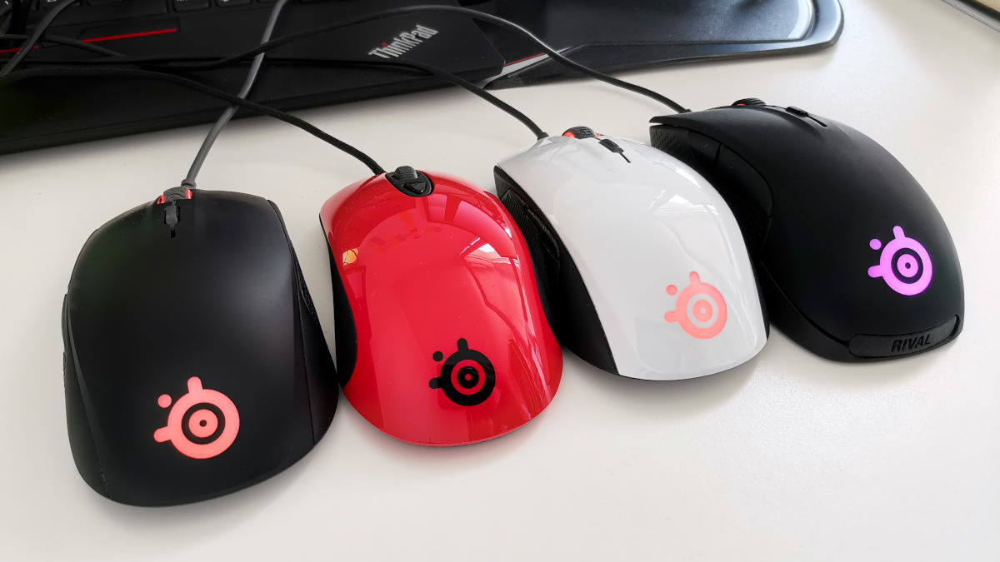

Welcome to rivalcfg's documentation!
====================================

|GitHub| |Discord| |PYPI Version| |Github Actions| |Black| |License|

Rivalcfg is a **Python library** and a **CLI utility program** that allows you
to configure SteelSeries gaming mice on Linux, macOS and Windows (probably works on
BSD too, but not tested).

I first created this program to configure my Rival 100 and the original Rival
mice, then I added support for other Rival devices thanks to contributors.
Today this project aims to support any SteelSeries gaming mice (Rival,
Sensei, Aerox, Prime,...).

.. IMPORTANT::

   This is an unofficial software. It was made by reverse engineering
   devices and is not supported nor approved by SteelSeries.

.. toctree::
   :maxdepth: 2
   :caption: Contents:

   ./requirements.rst
   ./install.rst
   ./cli.rst
   ./env.rst
   ./devices/index.rst
   ./python_api/index.rst
   ./faq.rst
   ./contributing.rst
   ./build/index.rst

Indices and tables
------------------

* :ref:`genindex`
* :ref:`modindex`
* :ref:`search`

.. |GitHub| image:: https://img.shields.io/github/stars/flozz/rivalcfg?label=Github&logo=github
   :target: https://github.com/flozz/rivalcfg

.. |Discord| image:: https://img.shields.io/badge/chat-Discord-8c9eff?logo=discord&logoColor=ffffff
   :target: https://discord.gg/P77sWhuSs4

.. |PYPI Version| image:: https://img.shields.io/pypi/v/rivalcfg?logo=python&logoColor=f1f1f1
   :target: https://pypi.org/project/rivalcfg/

.. |GitHub Actions| image:: https://github.com/flozz/rivalcfg/actions/workflows/python-ci.yml/badge.svg
   :target: https://github.com/flozz/rivalcfg/actions

.. |Black| image:: https://img.shields.io/badge/code%20style-black-000000.svg
   :target: https://black.readthedocs.io/en/stable/

.. |License| image:: https://img.shields.io/github/license/flozz/rivalcfg
   :target: https://github.com/flozz/rivalcfg/blob/master/LICENSE
